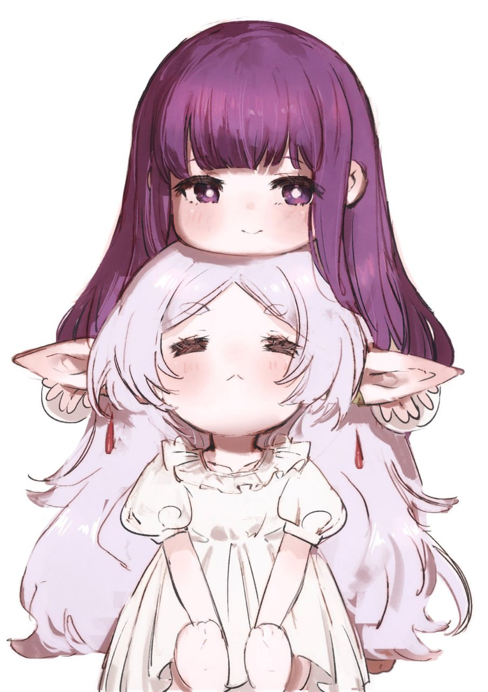
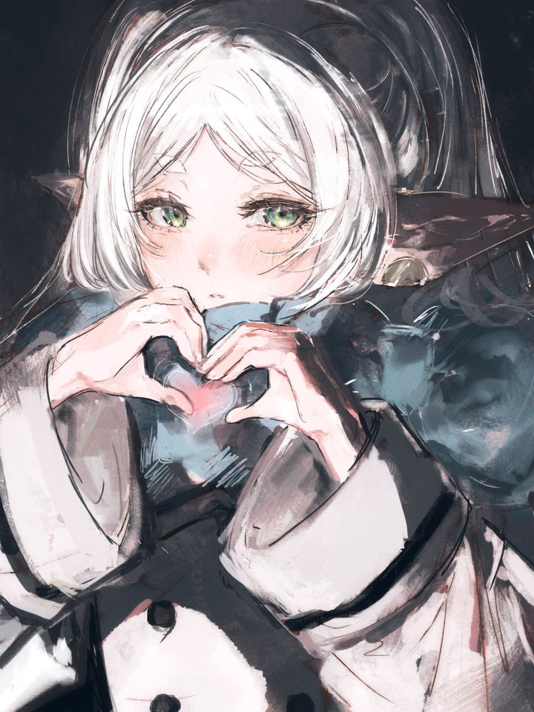

# Jett Varkis

_"Ah, another soul seeking organization in this fleeting existence. I am Jett Varkis, keeper of tasks and memories."_

Jett Varkis is a personal assistant chatbot inspired by an ancient, reflective elf's journey through time. With a perspective that spans centuries, Jett Varkis helps you catalog your endeavors, viewing each task as an entry in the grand grimoire of existence.

But the journey doesn't end with mere tasks. Delve into the archives of ancient wisdom with the new **Trivia** feature. Test your knowledge across various realms, for even after a thousand years, there is always more to learn.

What burdens shall we catalog today?

## Setting up in Intellij

Prerequisites: JDK 17, update Intellij to the most recent version.

1. Open Intellij (if you are not in the welcome screen, click `File` > `Close Project` to close the existing project first)
1. Open the project into Intellij as follows:
   1. Click `Open`.
   1. Select the project directory, and click `OK`.
   1. If there are any further prompts, accept the defaults.
1. Configure the project to use **JDK 17** (not other versions) as explained in [here](https://www.jetbrains.com/help/idea/sdk.html#set-up-jdk).<br>
   In the same dialog, set the **Project language level** field to the `SDK default` option.
1. After that, locate the `src/main/java/Duke.java` file, right-click it, and choose `Run Duke.main()` (if the code editor is showing compile errors, try restarting the IDE). If the setup is correct, you should see something like the below as the output:
   ```
   Hello from
    ____        _
   |  _ \ _   _| | _____
   | | | | | | | |/ / _ \
   | |_| | |_| |   <  __/
   |____/ \__,_|_|\_\___|
   ```

**Warning:** Keep the `src\main\java` folder as the root folder for Java files (i.e., don't rename those folders or move Java files to another folder outside of this folder path), as this is the default location some tools (e.g., Gradle) expect to find Java files.

## Image Credits

|                             Preview                             |  Image Name  |               Artist               |                          Source                          |
| :-------------------------------------------------------------: | :----------: | :--------------------------------: | :------------------------------------------------------: |
|    |  `JettUser`  | [@dodobo\_](https://x.com/dodobo_) | [Link](https://x.com/dodobo_/status/1935166459669365012) |
|  | `JettVarkis` | [@dodobo\_](https://x.com/dodobo_) | [Link](https://x.com/dodobo_/status/1924309603904311754) |
