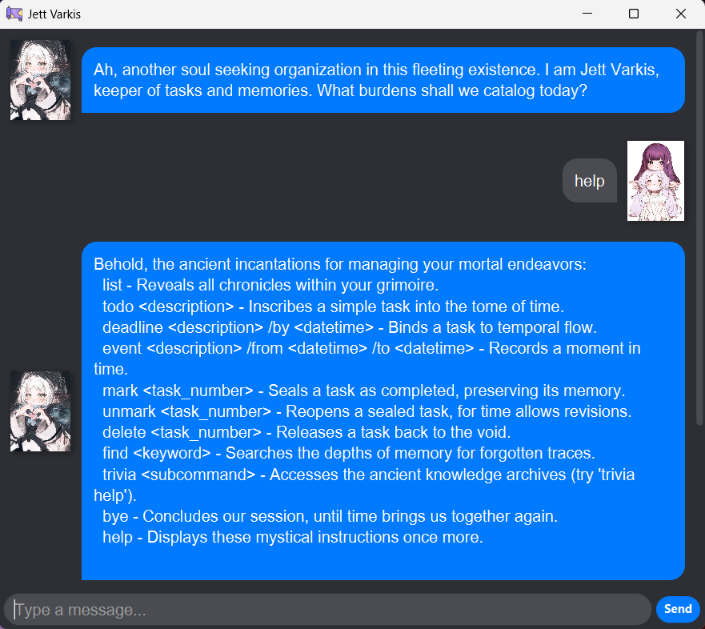

# Jett Varkis User Guide

_"Ah, another soul seeking organization in this fleeting existence. I am Jett Varkis, keeper of tasks and memories."_'

Welcome to the user guide for Jett Varkis, your personal assistant for managing tasks and exploring knowledge.

## Commands

Jett Varkis understands a variety of commands to help you manage your tasks and engage with the trivia feature.

### General Commands

| Command | Format | Description                                | Example |
| ------- | ------ | ------------------------------------------ | ------- |
| `help`  | `help` | Displays a list of all available commands. | `help`  |
| `bye`   | `bye`  | Gives a farewell message.                  | `bye`   |

### Task Management

| Command    | Format                                                | Description                                   | Example                                                        |
| ---------- | ----------------------------------------------------- | --------------------------------------------- | -------------------------------------------------------------- |
| `list`     | `list`                                                | Displays all tasks in your task list.         | `list`                                                         |
| `todo`     | `todo <description>`                                  | Adds a new to-do task.                        | `todo read a book`                                             |
| `deadline` | `deadline <description> /by <datetime>`               | Adds a task with a deadline.                  | `deadline submit report /by 2025-09-16 1800`                   |
| `event`    | `event <description> /from <datetime> /to <datetime>` | Adds an event with a start and end time.      | `event team meeting /from 2025-09-17 1400 /to 2025-09-18 1500` |
| `mark`     | `mark <task_number>`                                  | Marks one or more tasks as complete.          | `mark 1` or `mark 1 2`                                         |
| `unmark`   | `unmark <task_number>`                                | Marks one or more tasks as incomplete.        | `unmark 1` or `unmark 1 2`                                     |
| `delete`   | `delete <task_number>`                                | Deletes one or more tasks.                    | `delete 1` or `delete 1 2`                                     |
| `find`     | `find <keyword>`                                      | Finds tasks containing the specified keyword. | `find book`                                                    |

**Note on Date/Time Formats:** The accepted formats for `<datetime>` are `d/M/yyyy HHmm`, `yyyy-MM-dd HHmm`, `d/M/yyyy`, and `yyyy-MM-dd`.

### Trivia

| Command            | Format                              | Description                                              | Example                                                        |
| ------------------ | ----------------------------------- | -------------------------------------------------------- | -------------------------------------------------------------- |
| `trivia help`      | `trivia help`                       | Displays all available trivia commands.                  | `trivia help`                                                  |
| `trivia list`      | `trivia list`                       | Lists all available trivia categories.                   | `trivia list`                                                  |
| `trivia list /l`   | `trivia list /l`                    | Lists all questions in the currently selected category.  | `trivia list /l`                                               |
| `trivia create`    | `trivia create <category_name>`     | Creates a new trivia category.                           | `trivia create History`                                        |
| `trivia select`    | `trivia select <category_name>`     | Selects a trivia category to interact with.              | `trivia select History`                                        |
| `trivia add`       | `trivia add <question> \| <answer>` | Adds a new question and answer to the selected category. | `trivia add Who was the first president? \| George Washington` |
| `trivia start`     | `trivia start`                      | Starts a trivia quiz on the selected category.           | `trivia start`                                                 |
| `trivia stop`      | `trivia stop`                       | Stops the current trivia quiz.                           | `trivia stop`                                                  |
| `trivia delete`    | `trivia delete <question_number>`   | Deletes a question from the selected category.           | `trivia delete 1`                                              |
| `trivia delete /c` | `trivia delete /c <category_name>`  | Deletes an entire trivia category.                       | `trivia delete /c History`                                     |
